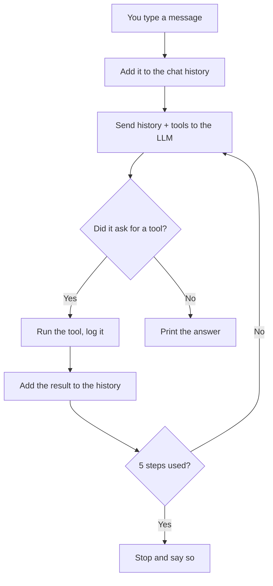
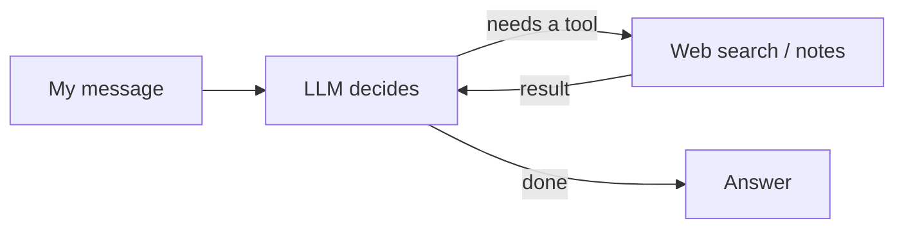

# 📚 Study Buddy

**An AI study agent you build yourself in 45 minutes.** Type a topic and Study Buddy searches the web, explains it simply, saves a short note, and remembers what you've studied. Say "quiz me" and it tests you.

It's plain Python with no agent framework, so you can see every step of the agent loop: **perceive → reason → act → observe**.


> ### 🆘 Stuck or behind? One command catches you up:
> ```
> python catch_up.py 2
> ```
> Use the number of the checkpoint you want to jump to (0 to 4). **Your own work is saved first** in `my_attempts/`, and your keys and notes are never touched.

---

## Contents

1. [Setup (do this at home, before the session)](#setup-do-this-at-home-before-the-session)
2. [The checkpoints](#the-checkpoints)
3. [How the project is organised](#how-the-project-is-organised)
4. [Save your work to GitHub](#save-your-work-to-github)
5. [Make it yours](#make-it-yours)
6. [Share it](#share-it)

---

## Setup (do this at home, before the session)

It takes about 30–40 minutes, even on a laptop that has never been used for coding. At the end, the hello test must say **You're ready!**

👉 **Follow the step-by-step guide in [SETUP.md](SETUP.md).** It covers installing Python and VS Code, downloading this project (ZIP or `git clone`), getting your two free API keys, and running the hello test.

Once you're set up, every time you come back:

1. Open the project folder in VS Code, then **Terminal → New Terminal**.
2. Switch on the virtual environment: `.venv\Scripts\activate` (Mac: `source .venv/bin/activate`).
3. Start Study Buddy: `python main.py`

Right now it's a plain chatbot: it doesn't know who it is, forgets what you said, and can't look anything up. **In the session, you'll turn it into an agent.** Type `quit` to leave.

---

## The checkpoints

In the session we build Study Buddy in 4 checkpoints. Each gap in the code is marked `# CHECKPOINT N` with a hint underneath. You only ever edit the three files in **`your_code/`**.

After each checkpoint, restart Study Buddy (`quit`, then `python main.py`) and check you see the result below.

### Checkpoint 1: The brain

*Concepts: instructions, short-term memory*

- **Do (`your_code/prompts.py`):** fill in the system prompt: **ROLE**, **GOAL**, **RULES** and **STYLE**. Replace each bracketed example line with your own words.
- **Do (`your_code/agent.py`):** add each new message to the chat history list, and add the reply after it, so the whole conversation is sent every time.
- **You should see:** it stays in character as a friendly study buddy. Say `my name is Aarav`, then ask `what's my name?` and it remembers.

### Checkpoint 2: The hands

*Concepts: tools, the agent loop*

- **Do (`your_code/tools.py`):** write the web search description: what it does, when to use it, and the one input it needs (the search words). Copy the style of the Wikipedia example.
- **Do (`your_code/agent.py`):** fill the "Yes" branch of the loop: read which tool the LLM asked for, run it, add the result to the history, go back to the LLM.
- **You should see:** ask `what's new in quantum computing this month?` and a yellow line appears, **🔧 calling web search: quantum computing news...**, then an answer with sources.

### Checkpoint 3: The memory

*Concept: long-term memory*

- **Do (`your_code/tools.py`):** write the descriptions for **Save note** and **Read notes**.
- **Do (`your_code/prompts.py`):** add two rules: after explaining a topic, save a 3-line summary; when asked what you've studied, read the notes first.
- **You should see:** learn one topic, close the program, reopen it, ask `what have I studied?` and it lists the topic with the date. Your notes are in `notes/study_notes.txt`.


### Checkpoint 4: Stretch (pick one)

| Option | What you add | You should see |
| --- | --- | --- |
| [Quiz mode](stretch/quiz_mode.md) | A prompt rule: when you say "quiz me", read the notes and ask 3 multiple-choice questions one at a time | A 3-question quiz on what you studied, with a score |
| [A second tool](stretch/second_tool.md) | Switch on Wikipedia search alongside web search | The agent choosing between the two tools and saying why |
| [A web page](stretch/web_page/README.md) | Run the ready-made template in `stretch/` | Study Buddy in a browser chat window |

### Catching up

| If you're behind at the start of... | Run |
| --- | --- |
| Checkpoint 2 | `python catch_up.py 1` |
| Checkpoint 3 | `python catch_up.py 2` |
| Checkpoint 4 | `python catch_up.py 3` |
| Want the finished quiz version? | `python catch_up.py 4` |
| Want to start over from scratch? | `python catch_up.py 0` |

Your own attempt is saved in `my_attempts/before_cpN/`. Compare it with the working version afterwards - that's often where the learning happens.

---

## How the project is organised

```
study-buddy-agent/
├── your_code/        ← the only folder you edit
│   ├── prompts.py        the system prompt (the agent's instructions)
│   ├── tools.py          the tools, and their descriptions for the LLM
│   └── agent.py          the agent loop and the chat history
├── main.py           run this to chat with Study Buddy
├── hello_test.py     checks your setup
├── catch_up.py       jumps to the end of any checkpoint
├── SETUP.md          step-by-step setup for a brand-new laptop
├── core/             pre-built parts (talking to Groq, drawing the screen)
├── checkpoints/      finished copies of your_code/ for each checkpoint
├── stretch/          the Checkpoint 4 options
├── docs/             the helpers' cheat sheet and the README pictures
├── notes/            your saved study notes (created when you first save one)
└── .env              your keys (you create this; never uploaded)
```

This is the loop you complete in `your_code/agent.py`:



---

## Save your work to GitHub

Do this at the end of the session (and whenever you change something).

**The first time only**, create your own repository and connect the project to it: follow [SETUP.md, Phase G](SETUP.md#phase-g-save-your-work-to-github-later-optional).

After that, every time you want to save:

```
git add .
git commit -m "Finished Study Buddy checkpoint 3"
git push
```

Your keys (`.env`) and notes are never uploaded - they're listed in `.gitignore`.

Prefer clicking? In VS Code, open the **Source Control** panel (the branch icon on the left), type a message, click **Commit**, then **Sync Changes**.

---

## Make it yours

Your repo is now a portfolio project. Replace this README with your own. Copy this template into `README.md` and fill in the brackets:

````markdown
# 📚 Study Buddy

[One line: what it does and who it's for. E.g. "An AI agent that researches any topic,
explains it simply, and quizzes me on what I've learned."]

  <!-- record a short GIF of it working -->

## How it works

Study Buddy is an AI agent built in plain Python, with no agent framework.
Each message goes round a loop: perceive → reason → act → observe.



- **Brain:** a Groq-hosted LLM, steered by a system prompt I wrote (role, goal, rules, style)
- **Hands:** tools for web search (Tavily), saving notes and reading notes
- **Memory:** chat history (short-term) and a notes file (long-term)

## What I'd add next

- [ ] [An idea, e.g. flashcards from my notes]
- [ ] [Another idea]
- [ ] [Another idea]

## Run it yourself

See the setup steps in the original project: [link to the original repo]
````

---

## Share it

Built something you're proud of? Post it on LinkedIn. A template:

```
I built my first AI agent today! 🤖📚

The problem: [e.g. I waste time jumping between tabs when I study a new topic.]

So I built Study Buddy: it searches the web, explains any topic simply,
saves notes, and quizzes me on what I've learned.

[attach a 20-second screen recording]

What I learned:
• An agent is just a loop: perceive → reason → act → observe
• Tool descriptions decide WHEN the AI uses a tool
• Memory is just data you give back to the model

Code: [your repo link]

#AI #AgenticAI #Python #LearningInPublic
```
